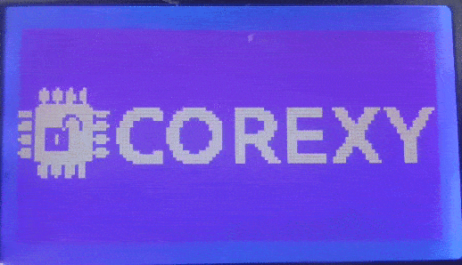

# Custom Marlin 3D Printer Firmware : COREXY

## Building Marlin 2.0

To build Marlin 2.0.6 we are using [PlatformIO](http://docs.platformio.org/en/latest/ide.html#platformio-ide). Detailed build and install instructions are posted at:

  - [Installing Marlin (VSCode)](http://marlinfw.org/docs/basics/install_platformio_vscode.html).

### Supported Platforms

  Platform|MCU|Example Boards
  --------|---|-------
  [Arduino AVR](https://www.arduino.cc/)|ATmega|RAMPS 1.4
  [Geeetech AVR](https://www.geeetech.com/gt2560-a-3d-printer-controller-board-p-915.html)|ATmega|GT2560 Rev A+

## Marlin Firmware:
I sincerely thank Marlin Firmware project Authors, Maintainers and Contributors for their contribution to project.\
If you wish to contribute to original Marlin Firmware Project, you should definitely check out links below:
  - [Marlin Firmware Github Page](https://github.com/MarlinFirmware/Marlin.git)
  - [Marlin Firmware Website](https://marlinfw.org/)

## Modifications

I have disabled / commented Marlin static bootscreen which includes Marlin firmware logo, version and website URL.
  - Actual Marlin static bootscreen logo is disabled at : [Marlin/src/lcd/dogm/ultralcd_DOGM.cpp](https://raw.githubusercontent.com/ogdhekne/marlin-corexy/master/Marlin/src/lcd/dogm/ultralcd_DOGM.cpp)
  - Search in that file using #disabled_code

## License

Marlin is published under the [GPL license](https://github.com/ogdhekne/marlin-corexy/blob/master/LICENSE) because we believe in open development. The GPL comes with both rights and obligations. Whether you use Marlin firmware as the driver for your open or closed-source product, you must keep Marlin open, and you must provide your compatible Marlin source code to end users upon request. The most straightforward way to comply with the Marlin license is to make a fork of Marlin on Github, perform your modifications, and direct users to your modified fork.

While we can't prevent the use of this code in products (3D printers, CNC, etc.) that are closed source or crippled by a patent, we would prefer that you choose another firmware or, better yet, make your own.